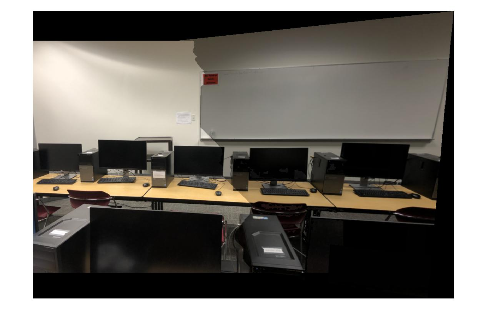
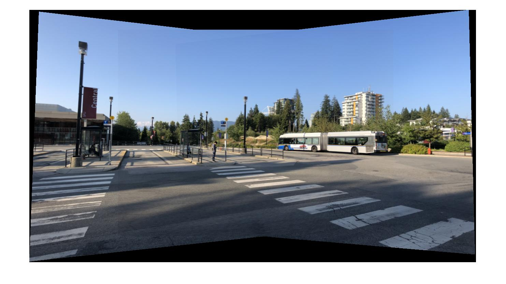
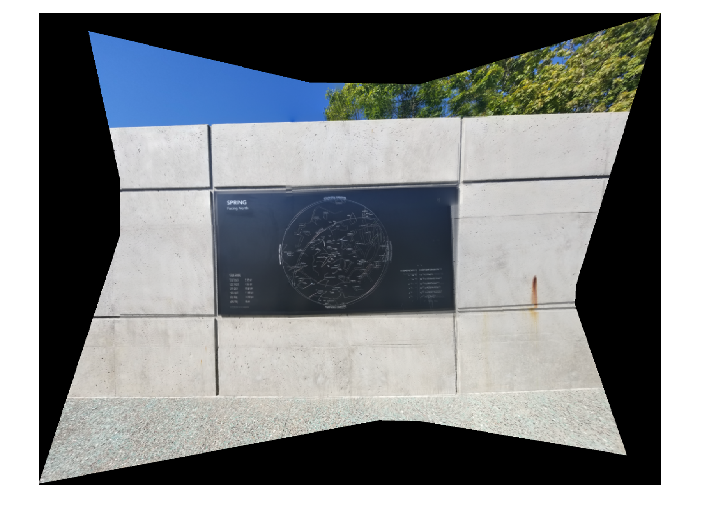

# Photo Stitching

## Introduction and Problem Definition

We are implementing a photo stitching pipeline with various blending techniques. There are several stages in the pipeline including:

1. corner detection
2. feature extraction
3. feature matching
4. images blending

For each of the stages, we have chosen to implement Harris Corner Detector, a SIFT-like feature descriptor, sum-of-squared-difference (SSD) ratio test as criterion for feature matching, and also examined various blending techniques to produce different results including Laplacian blending with minimum cut, minimum cut without blending and Poisson blending. In this report, we will compare results of those techniques and discuss strengths and weaknesses of them.

## Implementation of the Photo Stitching Pipeline

### Harris Corner Detector

As introduced in class, Harris Corner Detector makes use of changes in image intensity around corners. The idea is that around corners of objects in images, when a patch with particular size moves along vertical and horizontal direction, image intensity changes on both directions while it is changing on one direction around edges and no change around areas that are not corners or edges. We have followed the slides for implementation details.

#### Separating the image

In order to get more uniformly distributed corner responses from images which have both high and low luminance, we decided to use the following steps to generate better results instead of running the algorithm directly on the original image:

1. Divide the original image to four sub-images;
2. Run corner detection algorithm on each sub-image;
3. Combine results from the four subimages to form a final corner detection results.

Result generated from standard corner detection

Result generated by applying separate image technique

### SIFT

SIFT extracts features by detected corners according to their gradient information within certain neighbourhood regions. The size of a regions is typically 88 or 16 16. Our implementation uses 16 16 regions as it is in Lowe’s implementation. The 16 histograms of oriented gradients encapsulate information by summing gradients in 8 directions for each 4 4 subregion.

### Feature Matching and Homography Generation

Once we have the features extracted by SIFT descriptor, we need to produce feature matching pairs. We have implemented sum-of-squared-difference (SSD) ratio test which will calculate the ratio of the SSD of the best match for a particular feature and the SSD of the second best match. We then rank the calculated ratios descendingly to get the best matches. Great feature representatives will have the characteristic that the SSD for the best matches will be small while the SSD for the second best matches will be large.

#### RANSAC Process

In terms of homography generation, we have implemented RANSAC process to reduce the effect of outliers. We randomly pick 4 feature correspondence to generate a homography and record how many inliers agree with the particular homography. At the end of the random process of around 10,000 trials, we pick the homagraphy that has the most inliers as the output.

RANSAC is able to deal with outliers effectively

## Comparison of Image Blending Techniques

With the homography computed, we are able to transform images to the output image space, and the pixel value of the transformed images can be computed by inverse mapping. Therefore, the next step is to blend transformed input images together and assure the quality of overlapping region. We have examined the following strategies to blend images.

1. Naive Averaging
2. Minimum Cut
3. Minimum Cut with Laplacian Blending
4. Poisson Blending

### Naive Averaging

We found that naive averaging can produce plausible results when luminance difference between input images is small; also, it requires better alignment compared to other blending algorithms. Otherwise, it could suffer from severe ghost effect when using Naive Averaging. Therefore, although the naive approach is computationally efficient, it is not very useful in practice.

The result below was generated from a video clip and naive averaging was used to blend images. In this case, since all frames are coming from the same video, luminance of those selected frames are close, and therefore, naive averaging can still produce plausible result.

### Minimum Cut

Computing and applying minimum cut to the overlapping region can improve quality of the result with negligible additional computation time. Ghost effects can be eliminated effectively by using this strategy; however, a noticeable line/curve might show up due to luminance difference.

### Minimum Cut with Laplacian Blending

It is not only able to solve the ghost effect problem, but also reduce the separated line effect by using minimum cut alongside with Laplacian blending. Generally speaking, in most cases, this method can produce decent output with very reasonable computation time, and for this reason, we think this can be used as primary strategy.

While generally speaking this is a decent method, using minimum cut with Laplacian blending cannot really deal with large luminance difference very well. More specifically, if input images have large luminance difference, although it will not produce an apparent separate line, luminance difference between different sides of the output image can still be noticeable.

Luminance difference between left and right hand side is very obvious

### Poisson Blending

To deal with large luminance difference between input images, we found that poisson blending is a good option, but at the same time, Poisson blending might have ghost effect problem.

One possible solution to the ghost effect in Poisson blending result is to use only pixel information from one image as background instead of using average of the two input images. There are many different ways to get pixel information, and we found that applying minimum cut is generally a good strategy to extract pixel information from overlapping region of one image. However, in terms of capability of dealing with large luminance difference, this strategy is not as powerful as the Poisson blending we mentioned previously.

Moreover, we also realize another obvious downside of poisson blending: performance issue. Under the hood, we are solving a large sparse matrix with dimensions millions by millions. It takes up large chunk of time and memory to construct the sparse matrix. One interim solution we have tried is to implement a C++ MATLAB extension function dedicated for sparse matrix construction. In conclusion, Poisson blending is another decent method in that it produces the most natural images with least luminance difference among our tested blending techniques, nevertheless, it may not be used in practice due to memory usage inefficiency unless we have a better implementation of Poisson blending.

### Conclusion of Image Blending

To sum up, minimum cut with Laplacian blending is generally a good choice while Poisson blending is able to deal with luminance problem better. Minimum cut is an option when computation power is a constraint, but naive averaging strategy is usually not very useful in practice considering we have algorithms which can produce better result with similar computation complexity.

## Failure Cases

As we have discussed, there is not a single method that can deal with all scenarios. We have talked about drawbacks of each method in the discussion above and there were failure images compared generated by unsuitable methods compared to decent methods.

In this section, we would like to point out that for images with different viewing angles, they may not be stitched well.

Original Images with Objects in Different Angles

Output Images with Ghost Effects

We have another example with photos taken at a bus stop. The scenario is complex in that there were bus moving, flags waving and also the viewing angle is a bit different for one or two images.

## More Results

### Example 1: Bus Stop

Naive Averaging

Minimum Cut

Minimum Cut with Laplacian Blending

Poisson Blending

### Example 2: Maggie Benston Centre and Terry Fox Field

Naive Averaging

Minimum Cut

Minimum Cut with Laplacian Blending

Poisson Blending

### Example 3: Outside SFU Library

Naive Averaging

Minimum Cut

Minimum Cut with Laplacian Blending

Poisson Blending

### Example 4: The Observatory

Naive Averaging

Minimum Cut

Minimum Cut with Laplacian Blending

Poisson Blending

### Example 5: Applied Science Building

Naive Averaging

Minimum Cut

Minimum Cut with Laplacian Blending

Poisson Blending

### Example 6: Library

Naive Averaging

Minimum Cut

Minimum Cut with Laplacian Blending

Poisson Blending

### Example 7: Indoor Scene

Naive Averaging

Minimum Cut

Minimum Cut with Laplacian Blending

Poisson Blending
